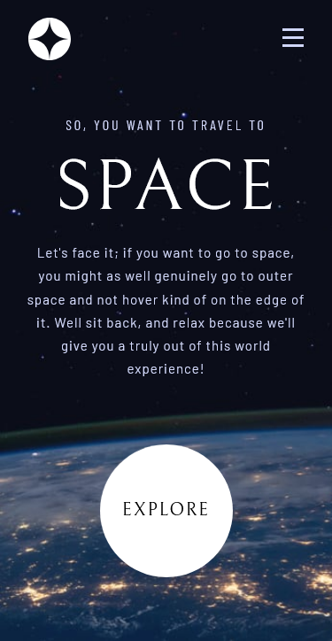
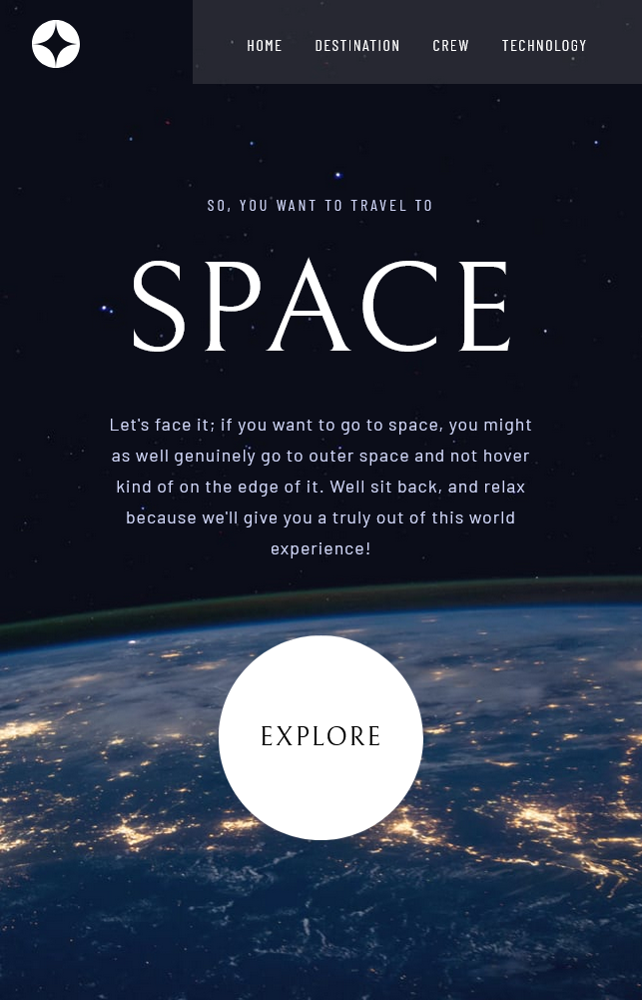
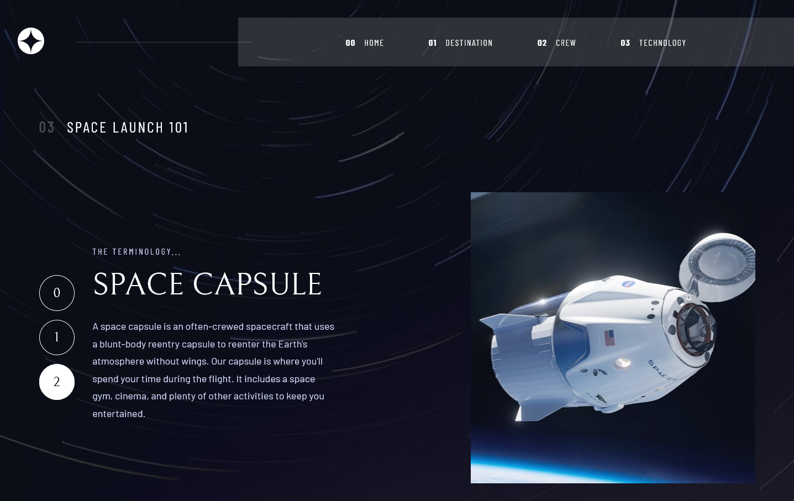

# Frontend Mentor - Space tourism website solution

This is a solution to the [Space tourism website challenge on Frontend Mentor](https://www.frontendmentor.io/challenges/space-tourism-multipage-website-gRWj1URZ3). Frontend Mentor challenges help you improve your coding skills by building realistic projects.

## Table of contents

- [Overview](#overview)
  - [The challenge](#the-challenge)
  - [Screenshot](#screenshot)
  - [Links](#links)
- [My process](#my-process)
  - [Built with](#built-with)
  - [What I learned](#what-i-learned)
  - [Continued development](#continued-development)
  - [Useful resources](#useful-resources)
- [Author](#author)
- [Acknowledgments](#acknowledgments)

## Overview

### The challenge

Users should be able to:

- View the optimal layout for each of the website's pages depending on their device's screen size
- See hover states for all interactive elements on the page
- View each page and be able to toggle between the tabs to see new information

### Screenshots

### Links

[Live site](https://space-tourism-kas.netlify.app/)

## My process

### Built with

- Sass
- Flexbox
- CSS Grid
- Mobile-first workflow
- [React](https://reactjs.org/)
- [React Router](https://reactrouter.com/)
- [Framer Motion](https://www.framer.com/motion/)

### What I learned

My first React project is done! I'm already pretty comfy with CSS and this challenge is kinda of CSS-heavy so I thought this would be a good starting point for working with React. I had to learn most of it on the go, as I was building out the app but I had a lot of fun. I also started experimenting with Framer Motion which is an amazing tool if somewhat intimidating at first >.<

I tried to keep it scalable and not to be too repetitive with my code. At some point, I even rewrote the whole thing to just use one component for all the Destination, Crew and Technology pages as they actually have a lot of similarities. This approach got rid of many of the repetitive bits but the end product was really hard to read so I scrapped it. I decided it's not worth sacrificing the readability. Some repetition will be there and that's perhaps not always a bad thing.

To still improve things a bit, I refactored my old code, created a new component for my buttons - which are repeating over all pages, just with different styles - and introduced some utility and shared classes. I ended up taking a hybrid approach to the CSS which I enjoyed a lot. I felt like I managed to get rid of some of the repetitiveness in my CSS without overwhelming the JSX too much.

### Continued development

The skip-nav link needs a fix ^^

I'll also play around more with Framer Motion! It can get pretty complex and there's definitely more to do with it than what I've attempted so far.

### Useful resources

- [Responsive navbar with React](https://www.youtube.com/watch?v=8kPk7CTOQh4) - This video helped a lot understanding and fixing some of the issues I had with resizing the window
- [Net Ninja's Framer Motion course](https://www.youtube.com/watch?v=2V1WK-3HQNk&list=PL4cUxeGkcC9iHDnQfTHEVVceOEBsOf07i) - Super useful for starting out with Framer Motion

## Author

- Frontend Mentor - [@FluffyKas](https://www.frontendmentor.io/profile/FluffyKas)
